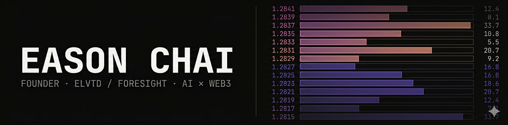

  

<h1 align="center">Eason Chai</h1>

  Founder of <a href="https://elvtd.io"><b>ELVTD</b></a> and <a href="https://foresight.now"><b>Foresight</b></a> 
  Engineer · AI × Web3 
  Malaysia-based, operating globally

  
  
  
  

---

## 🛠 What I'm building

A software consulting & development agency. We partner with teams serious about shipping in AI and Web3, from smart contract infrastructure through to product UX, and everything that holds it together. Recent work includes launches and infrastructure alongside **Virtual Protocol**, **SpaceComputer**, **Pudgy Penguins**, and **Nodies**, among others. Projects we've built with our partners have collectively crossed **$100M+ in TVL across EVM ecosystems**. We stay small on purpose; we ship for a living.

 

**Foresight** is a social-first prediction market. Prediction markets give you honest signal, people don't hedge their opinions when there's money on the line. Foresight takes that idea and builds it around the communities around you, allowing for more niche and contextual markets to be launched.

## 👤 About

Builder first, founder by path. I spend most of my time at the intersection of AI and Web3. The two fields I think will most reshape how teams build, ship, and coordinate.

Day to day, the work splits roughly three ways: shipping product at ELVTD and Foresight; showing up for the builders around me as a mentor, judge, and collaborator; and talking about the spaces I work in, on panels, podcasts, and stages like **Token2049** and **MYBW**, in rooms where the conversation actually moves the ecosystem forward.

Hackathons keep pulling me back. Sometimes building on the floor, sometimes on the judging table, sometimes just there for the people. It's where the most honest version of this industry still lives, and where I've met most of the folks I now build with.

**How I work:** get shit done, adaptable, creative by default. Scope is negotiable; shipping isn't.

## 📍 Other things worth knowing

- Built Malaysia's **first NFT Vending Machine**
- Wrote a production [**sigmoid bonding curve ERC721**](https://medium.com/@easonchaijw/an-actual-sigmoid-function-in-solidity-6b78d002d8be) in Solidity
- Previously led tech ops at [42KL](https://42kl.edu.my) — automation, tooling, and campus infrastructure
- Organized ETHKL 2024
- Active in the Malaysia and global Web3 communities — mentoring, hosting, and showing up

## 🤝 Work with me

|                                   |                                                                                     |
| --------------------------------- | ----------------------------------------------------------------------------------- |
| **Consulting & engineering**      | [elvtd.io](https://elvtd.io)                                                        |
| **Speaking, panels, podcasts**    | [echai2905@gmail.com](mailto:echai2905@gmail.com)                                   |
| **Hackathon mentoring & judging** | DM on [X](https://x.com/easonchaiii)                                                |
| **Everything else**               | [X](https://x.com/easonchaiii) · [LinkedIn](https://www.linkedin.com/in/easonchai/) |

## 📊 Activity

  
  

  

  

---

  Pinned repos below tell the rest of the story.

